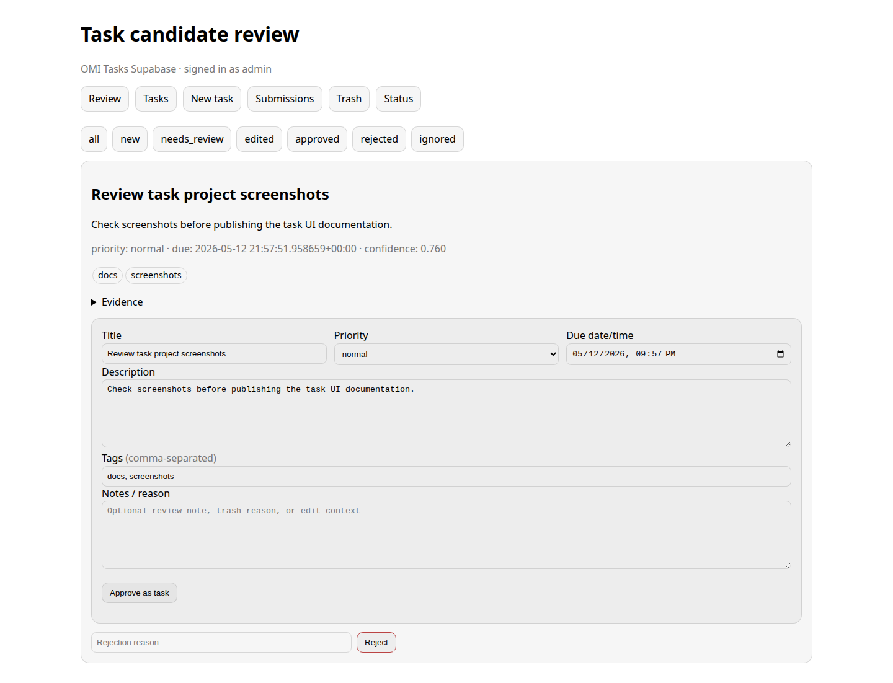
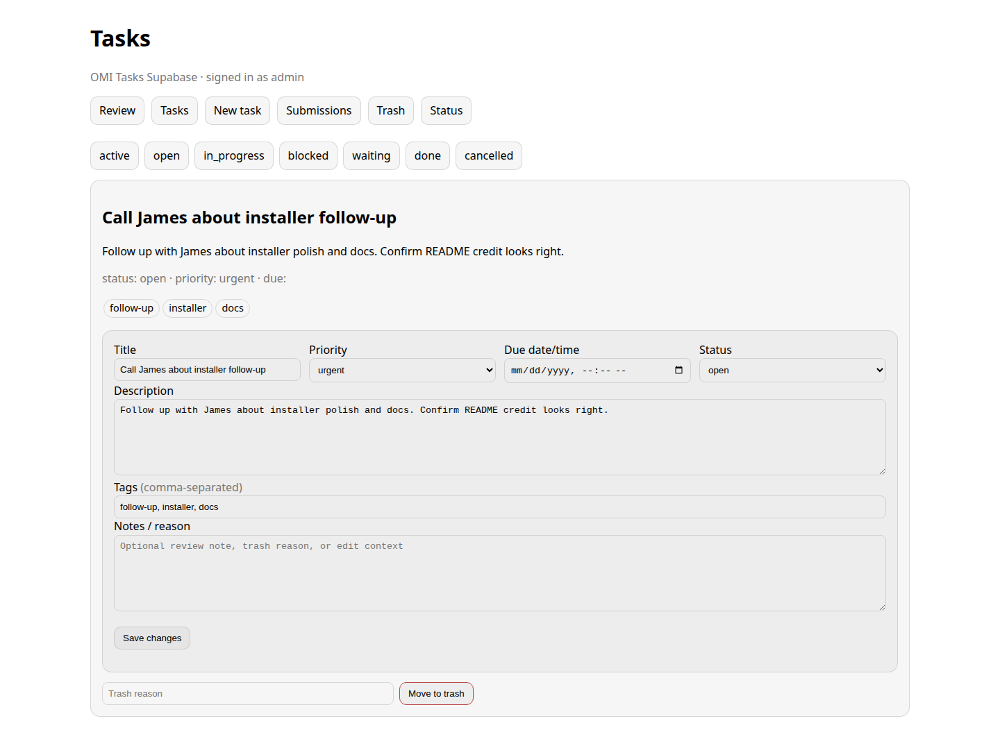
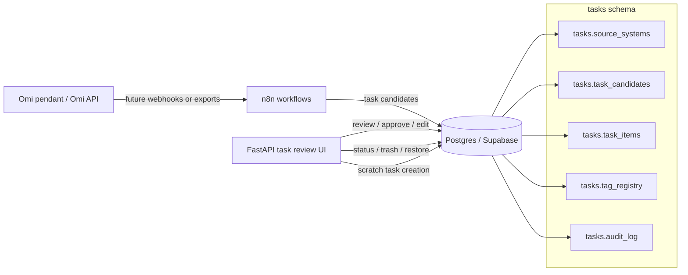

# OMI-Tasks-Supabase

> **Proof of Concept:** This project is an open-source first pass for reviewing Omi-derived task candidates in a self-hosted Postgres/Supabase-style database. It is not a security-audited product or turnkey SaaS. Review the code, secure your deployment, and avoid storing sensitive personal data unless your environment is properly protected.

OMI-Tasks-Supabase is a standalone task review and task lifecycle system inspired by OMI-Supabase, adapted for tasks instead of durable memories.

It combines:

- **Postgres / Supabase-compatible schema** under the `tasks` schema for task candidates, approved task items, tag registry, source systems, audit records, and trash/restore lifecycle.
- **FastAPI review UI** for reviewing task candidates, approving/editing/rejecting candidates, managing task status, trashing/restoring tasks, and creating scratch tasks.
- **Installer and Docker Compose files** for a local self-hosted Postgres + UI deployment, with optional local n8n for future workflow imports.

The design treats Omi captures as evidence. A transcript or memory can suggest a task, but the task does not become canonical until a person reviews it.

---

## Screenshots

### Task candidate review



### Primary tasks



---

## Architecture



---

## What this system does


### Load Omi action items

The review UI includes `/tasks/load-omi`, a Basic Auth protected page that calls the Omi Developer API action-items endpoint and stages returned items as `tasks.task_candidates`. Loaded items remain review candidates; they are **not** promoted to primary tasks until approved.

For live Omi loading, configure the task UI environment with:

- `OMI_API_BASE` pointing at the Omi API, normally `https://api.omi.me`
- `OMI_API_KEY` containing a valid Omi Developer API bearer token

Do not commit `.env` files or real Omi API keys.

### Review task candidates

The UI lists pending rows from `tasks.task_candidates`. For each candidate you can:

- approve it into `tasks.task_items`
- edit title, description, due date, priority, and tags during approval
- reject it with an optional reason
- inspect stored evidence JSON

### Manage approved tasks

Approved and scratch-created tasks support:

- statuses: `open`, `in_progress`, `blocked`, `waiting`, `done`, `cancelled`, `trashed`
- priorities: `low`, `normal`, `high`, `urgent`
- due dates
- comma-separated tags with a registry table
- audit logging for create, approve, edit, trash, restore, and reject actions

### Trash and restore

Tasks are soft-deleted by setting `status = 'trashed'`, preserving the record and audit trail. The trash view can restore tasks back to `open`.

---

## Repository layout

```text
.
├── docs/
│   ├── assets/screenshots/
│   ├── importGuide.md
│   ├── testing.md
│   └── visualDocumentation.md
├── scripts/
│   └── validate_package.sh
├── supabase/
│   └── sql/
│       └── 001_omi_tasks_supabase_setup.sql
├── website/
│   ├── docker-compose.n8n.yml
│   ├── docker-compose.test-postgres.yml
│   ├── docker-compose.website.yml
│   └── taskReviewUi/
│       ├── .env.example
│       ├── Dockerfile
│       ├── app.py
│       └── requirements.txt
├── install.sh
├── LICENSE
└── README.md
```

---

## Prerequisites

A clean Linux server or VM is enough. The examples below assume Ubuntu 24.04 or Debian 12.

You need:

- Docker Engine
- Docker Compose plugin
- Git
- A DNS name or server IP for accessing the web UI

Optional:

- A reverse proxy with TLS, such as Caddy, Nginx Proxy Manager, Traefik, or Nginx
- A real Supabase project instead of plain Postgres, if you want Supabase Studio/API features
- n8n, if you want to build Omi-to-task candidate extraction workflows

---

## Installer

```bash
./install.sh install
```

The installer will:

1. Check for Docker and Docker Compose.
2. Create `website/taskReviewUi/.env` if it does not exist.
3. Start the local Postgres database.
4. Apply the complete `tasks` schema SQL.
5. Build and start the web UI on port `8098`.

Open:

```text
http://SERVER_IP:8098/review
```

### Non-interactive install

```bash
./install.sh install --non-interactive
```

This generates a local UI password. Check `website/taskReviewUi/.env` after installation.

### Include local n8n

```bash
./install.sh install --with-n8n
```

Open n8n at:

```text
http://SERVER_IP:5679
```

This repo ships a starter n8n workflow export at `n8n/workflows/omi-tasks-candidate-intake.workflow.json`. Import it into n8n, attach an HTTP Basic Auth credential matching the task UI credentials, then activate it when ready. The optional local n8n container is included as a compatible workspace for adapting that flow.

### Start, stop, and status

```bash
./install.sh status
./install.sh stop --with-n8n
./install.sh start --with-n8n
```

### Cleanup / uninstall

```bash
./install.sh uninstall
```

For unattended cleanup:

```bash
./install.sh uninstall --yes
```

---

## Applying the schema manually

For a local Postgres instance:

```bash
psql "$DATABASE_URL" -v ON_ERROR_STOP=1 -f supabase/sql/001_omi_tasks_supabase_setup.sql
```

For Supabase, paste or run the SQL in `supabase/sql/001_omi_tasks_supabase_setup.sql` using your preferred Supabase migration workflow.

---

## Candidate import shape

Task extraction workflows can insert candidates like this:

```sql
insert into tasks.task_candidates (
  source_system_id,
  source_event_id,
  source_conversation_id,
  proposed_title,
  proposed_description,
  proposed_due_at,
  proposed_priority,
  proposed_tags,
  confidence,
  evidence
)
select
  source_system_id,
  'omi-event-123',
  'omi-conversation-456',
  'Follow up on the project plan',
  'The conversation suggested sending an updated project plan.',
  now() + interval '2 days',
  'normal',
  array['follow-up','project'],
  0.820,
  jsonb_build_object('snippet', 'Remember to send the updated project plan')
from tasks.source_systems
where source_key = 'omi';
```

---

## API candidate intake

The review UI exposes a Basic Auth protected JSON endpoint for workflow-created candidates:

```text
POST /tasks/api/candidates
```

Minimal payload:

```json
{
  "source_key": "omi",
  "source_event_id": "omi-event-id",
  "proposed_title": "Follow up on appointment scheduling",
  "proposed_description": "Evidence-backed candidate extracted from Omi conversation text.",
  "proposed_priority": "normal",
  "proposed_tags": ["omi", "follow-up"],
  "confidence": 0.72,
  "evidence": {"source": "omi"}
}
```

---

## Validation

```bash
./scripts/validate_package.sh
```

The validation script checks Python syntax, expected files, public-facing docs wording basics, and optionally applies the schema if `DATABASE_URL` is set and `psql` is installed.

---

## Security notes

- The UI uses HTTP Basic Auth. Put it behind HTTPS for any real deployment.
- Do not commit `.env` files or API keys.
- Keep Omi transcripts, memories, and extracted tasks private by default.
- This repo contains no sample personal data.

---

## License

MIT License. See [LICENSE](LICENSE).

## Internal Documentation

Obsidian documentation: `OpenClaw/Projects/OMI-Tasks-Supabase/`
